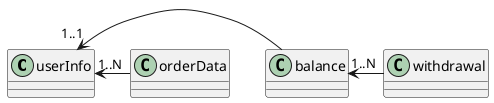

# ADR_007

## Название
Структура табилц в БД

## Статус
proposed

## Дата
2024-04-19

## Описание принятого/предложенного решения

## Недостатки решения

## Связана
ADR_004, ADR_005

## Комментарии
