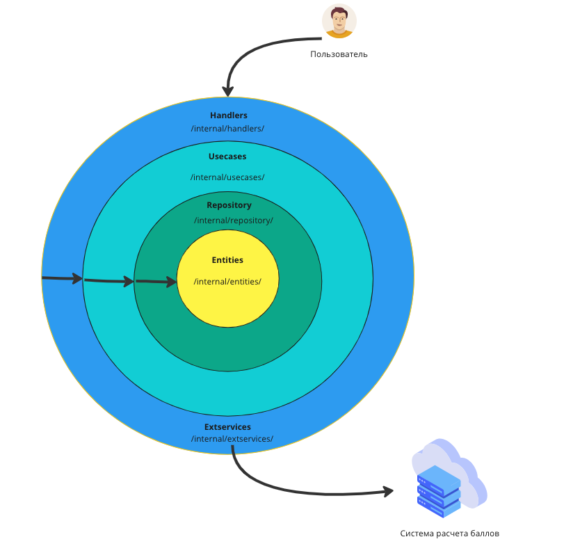
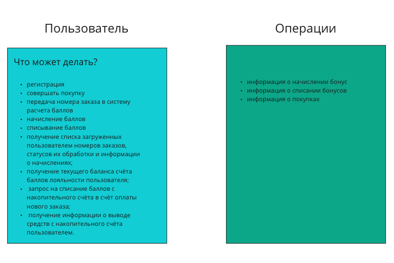

# Накопительная система лояльности «Гофермарт»

**Система представляет собой HTTP API со следующими требованиями к бизнес-логике:**

+ регистрация, аутентификация и авторизация пользователей;
+ приём номеров заказов от зарегистрированных пользователей;
+ учёт и ведение списка переданных номеров заказов зарегистрированного пользователя;
+ учёт и ведение накопительного счёта зарегистрированного пользователя;
+ проверка принятых номеров заказов через систему расчёта баллов лояльности;
+ начисление за каждый подходящий номер заказа положенного вознаграждения на счёт лояльности пользователя.

**Абстрактная схема взаимодействия с системой**
+ Пользователь регистрируется в системе лояльности «Гофермарт».
+ Пользователь совершает покупку в интернет-магазине «Гофермарт».
+ Заказ попадает в систему расчёта баллов лояльности.
+ Пользователь передаёт номер совершённого заказа в систему лояльности.
+ Система связывает номер заказа с пользователем и сверяет номер с системой расчёта баллов лояльности.
+ При наличии положительного расчёта баллов лояльности производится начисление баллов лояльности на счёт пользователя.
+ Пользователь списывает доступные баллы лояльности для частичной или полной оплаты последующих заказов в интернет-магазине «Гофермарт».

Примечания:
+ пункт 2 представлен как гипотетический и не требует реализации в данной работе;
+ пункт 3 реализован в системе расчёта баллов лояльности и не требует реализации в данной работе.

### Архитектура

Система состоит из следующих компонентов:



**Система расчета баллов лояльности**

Система расчета баллов лояльности является внешним сервисом в доверенном контуре. Он работает по принципу чёрного ящика и недоступен для инспекции внешними клиентами. Система рассчитывает положенные баллы лояльности за совершённый заказ по сложным алгоритмам, которые могут меняться в любой момент времени.

Внешнему потребителю доступна только информация о количестве положенных за конкретный заказ баллов лояльности. Причины наличия или отсутствия начислений внешнему потребителю неизвестны.

#### Сущности:



#### База данных:


### Ошибки

Все ошибки, возникающие в процессе работы системы, должны быть обработаны и корректно обработаны. В случае возникновения ошибки, система должна вернуть соответствующий код ошибки и описание ошибки.

```json
{
  "code": 400,
  "message": "неверный формат запрпоса"
}
```
Ошибка | Status Code | Описание
:---: |:-----------:| :---:
ErrBadRequest |     400     |неверный формат запрпоса
ErrInternal |     500     | внутренняя ошибка сервера
ErrUserOrPasswordBad |     401     | неверный логин или пароль
ErrUserBusy |     409     | логин уже занят
ErrOrderAlreadyLoaded |     409     | номер заказа уже был загружен другим пользователем;
ErrWrongOrderFormat |     422     | неверный формат заказа;
ErrLowBalance |     402     | недостаточно баллов лояльности для оплаты заказа;
ErrCountRequest |     429     | превышено количество запросов в секунду;

### Конфигурация приложения

Переменная окружения | Флаг командной стройки | Описание
--------------------- |:----------------------:| :--------:
RUN_ADDRESS           |           -a           | Адрес и порт для запуска приложения
DATABASE_URI          |           -d           | URI для подключения к базе данных
ACCRUAL_SYSTEM_ADDRESS|           -r           | Адрес системы расчёта баллов лояльности

user (-balance, -withdrawn) 
order (user_id, order_num, sum, status, type) = operations
balance (user_id, balance) как кэш баланса

Таблица взаимодействия (хендлеры) - диаграмма сервисов
